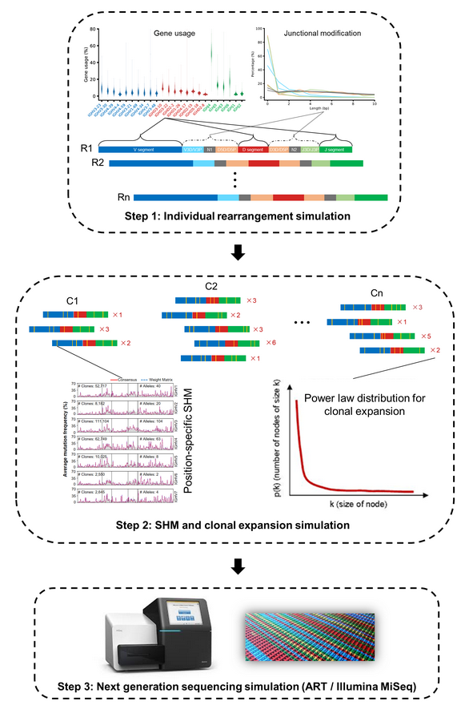

# IMPlAntS

**IMPlAntS** (***I***ntegrated and ***M***odular ***P***ipe***l***ine for ***Ant***ibody Repertoire ***S***imulation) simulates antibody heavy chain repertoire sequencing dataset according to serveral key features learned from a collection of 2152 high-quality Ig-seq dataset (refer to [https://doi.org/10.1101/814590](https://doi.org/10.1101/814590)). These features consist of germline gene usage, junctional modification, positional-specific somatic hypermutation and clonal expansion. 


## Table of contents
* [Dependencies](#dependencies)
* [Initialization](#initialization)
* [Schematic diagram](#schematic-diagram)
* [Simulation pipeline](#simulation-pipeline)
	* [One-stop simulation](#one-stop-simulation)
	* [Modular simulation](#modular-simulation)
		* [1. Independent rearrangement simulation](#independent-rearrangement-simulation)
		* [2. Phylogenetic SHM and clonal expansion simulation](#phylogenetic-shm-and-clonal-expansion-simulation)
		* [3. Next-generation sequencing simulation](#next-generation-sequencing-simulation)


## Dependencies
IMPlAntS is totally developped based on Python. The pipeline was tested successfully with both Python 2.7.14 and Python 3.7.4. Besides, two additional modules, `pandas` and `Bio `, are required and they can be installed using `pip` on the commandline (e.g. `pip install pandas biopython`).


## Initialization
In Linux OS, users can add the main directory into the environment variable, `PATH`, to enable free calling IMPlAntS utilities. The following is an example.

```
export PATH=/path/to/IMPlAntS-main:$PATH
```


## Schematic diagram



## Simulation pipeline
The simulation pipeline can be implemented either [separately](#modular-simulation) or [collectively](#one-stop-simulation) using corresponding IMPlAantS' subcommands. 

### One-stop simulation
You can also implement all the individual steps needed for a complete simulation by a single command as below,
```
python implants.py
	-ir rearrangement_fasta_file # output rearrangement fasta file
	-is shm_fasta_file  # output shm fasta file
	-ie expand_fasta_file  # output expand fasta file
	-ig basename  # basename for resulting ngs reads (pair-end)
	-s seed  # seed for random number generation for reproducible simulation
	-nr rearrangment_num  #  the number of resultant unique rearrangements
	-pp prod_pct  # proportion of sequence undergoing SHM events in each evolution
	-t evol_times  # the number of times for evolution
	-ns max_seqs  # the maximum number of resultant sequences for shm fasta file
	-ne max_seqs  # the maximum number of resultant sequences for expand fasta file (If the number of output sequences exceeds this number, this script will automatically exit.)
	-p prop  # proportion of sequence undergoing SHM events in each evolution
	-d out_dir 
```

### Modular simulation
As for the first step, a series of key parameters can be specified in the configuration files. These parameters include gene usage, allele ratio, the distribution of insertion and deletion length, and the percentage of productive rearrangements. 
```
python Generate_Rearrangements.py
	-n rearrangment_num  # the number of resultant unique rearrangements
	-pp prod_pct  # percentage of productive rearrangements
	-s seed  # seed for random number generation for reproducible simulation
	-d out_dir  # output directory
	-o rearrangement_fasta_file  # output rearrangement fasta file
```

In the second step, we generate SHMs in rearrangement sequences in a way like [Yermanos et al., 2017](https://doi.org/10.1093/bioinformatics/btx533) to create the phylogenetic sequences as is in the real repertoire. The resultant repertoire with SHMs comes from several iterations. In each iteration, a customizable fraction of sequences in current pool are selected and then subjected to SHM. The SHMs are generated based on a positional mutability model and a positional substitutability model. These two models, together with the parameters involved in the first step, were learned from a large scale study we launched before [(Yang et al., 2019)](https://doi.org/10.1101/814590). 
```
python Generate_SHM.py
	-i rearrangement_fasta_file  # input rearrangement fasta file
	-s seed  # seed for random number generation for reproducible simulation
	-t evol_times  # the number of times for evolution
	-n max_seqs  # the maximum number of resultant sequences
	-p prop  # proportion of sequence undergoing SHM events in each evolution
	-d out_dir  # output directory
	-o shm_fasta_file  # output shm fasta file
```

```
python Generate_Clonal_Expansion.py
	-i shm_fasta_file  # input shm fasta file
	-a alpha  # alpha value used in power law model
	-t top_num  # the number of sequences for the largest clone
	-n max_seqs  # the maximum number of output sequences (If the number of output sequences exceeds this number, this script will automatically exit.)
	-d out_dir  # output directory
	-o expand_fasta_file  # output expand fasta file
```


Finally, we employ a popular NGS simulation tool, ART, to produce sequencing reads
```
python Generate_Sequencing_Reads.py
	-i expand_fasta_file  # input expand fasta file
	-s seed  # seed for random number generation for reproducible simulation
	-d out_dir  # output directory
	-b basename  # basename for resulting ngs reads (pair-end)
```