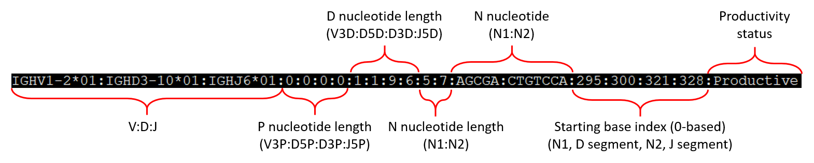

# IMPlAntS

**IMPlAntS** (***I***ntegrated and ***M***odular ***P***ipe***l***ine for ***Ant***ibody Repertoire ***S***imulation) simulates antibody heavy chain repertoire sequencing dataset according to serveral key features learned from a collection of 2152 high-quality Ig-seq dataset (refer to [https://doi.org/10.1016/j.celrep.2021.109110](https://doi.org/10.1016/j.celrep.2021.109110)). These features consist of germline gene usage, junctional modification, positional-specific somatic hypermutation and clonal expansion. 


## Table of contents
* [Dependencies](#dependencies)
* [Initialization](#initialization)
* [Schematic diagram](#schematic-diagram)
* [Simulation pipeline](#simulation-pipeline)
	* [One-stop simulation](#one-stop-simulation)
	* [Modular simulation](#modular-simulation)
		* [1. Individual rearrangement simulation](#individual-rearrangement-simulation)
		* [2. SHM and clonal expansion simulation](#shm-and-clonal-expansion-simulation)
		* [3. Next generation sequencing simulation](#next-generation-sequencing-simulation)


## Dependencies
**IMPlAntS** is totally developped based on Python. The pipeline was tested successfully with both Python 2.7.14 and Python 3.7.4. Besides, two additional modules, `pandas` and `Bio`, are required and they can be installed using `pip` on the commandline (e.g. `pip install pandas biopython`).


## Initialization
In Linux OS, users can add the main directory into the environment variable, `PATH`, to enable free calling **IMPlAntS** utilities. The following is an example.

```
export PATH=/path/to/IMPlAntS:$PATH
chmod +x implants ramsim shmsim ngssim repsim art_illumina
```


## Schematic diagram


## Simulation pipeline
The simulation pipeline can be implemented either [collectively](#one-stop-simulation) or [separately](#modular-simulation) using corresponding IMPlAantS' subcommands. 
```
.___    _____  __________ .__      _____            __    _________
|   |  /     \ \______   \|  |    /  _  \    ____ _/  |_ /   _____/
|   | /  \ /  \ |     ___/|  |   /  /_\  \  /    \\   __\\_____  \ 
|   |/    Y    \|    |    |  |__/    |    \|   |  \|  |  /        \
|___|\____|__  /|____|    |____/\____|__  /|___|  /|__| /_______  /
             \/                         \/      \/              \/ 
IMPlAnts (Integrated and Modular Pipeline for Antibody Repertoire 
Simulation) simulates antibody heavy chain repertoire sequencing dataset 
according to serveral key features learned from a collection of 2152 
high-quality Ig-seq dataset.

Subcommands:
    ramsim    Simulate independent rearranged V(D)J sequences
    shmsim    Simulate clonally expanded sequences with phylogenetic SHMs
    ngssim    Simulate NGS reads via ART
    repsim    De novel simulate antibody heavy chain repertoire dataset

Other:
    -h        Print this message
        
```


### One-stop simulation
You can use IMPlAntS to simulate antibody repertoire sequencing dataset simply via a single subcommand, `repsim`. All key parameters are set by default, so you can test this pipeline without specifying any parameter by executing the following command,

`implants repsim`

To customize one or more parameters involved in the pipeline, user can refer to help message by invoking `implants repsim -h`. This will show the following information,

```
usage: repsim [-h] [-vu V_USAGE_FILE] [-du D_USAGE_FILE] [-ju J_USAGE_FILE]
              [-vr V_REFERENCE] [-dr D_REFERENCE] [-jr J_REFERENCE] [-v3d V3D]
              [-d5d D5D] [-d3d D3D] [-j5d J5D] [-v3p V3P] [-d5p D5P]
              [-d3p D3P] [-j5p J5P] [-n1 N1] [-n2 N2] [-v3Odd V3ODD]
              [-d5Odd D5ODD] [-d3Odd D3ODD] [-j5Odd J5ODD]
              [-n N_REARRANGEMENTS] [-pp PCT_PROD] [-m MUT] [-p SUB]
              [-f MUT_ABILITY_FOLD] [-T TIMES] [-pr PROPORTION] [-ns NSEQS]
              [-a ALPHA] [-t TOPNUM] [-ne NMAX] [-art ART_PATH] [-d DIR]
              [-s SEED] [-or OUTPUTR] [-os OUTPUTS] [-oc OUTPUTC]
              [-b BASENAME]

repsim de novo simulates antibody heavy chain repertoire dataset.

optional arguments:
  -h, --help            show this help message and exit
  -vu V_USAGE_FILE, --v_usage_file V_USAGE_FILE
                        Path to V allele usage statistics
  -du D_USAGE_FILE, --d_usage_file D_USAGE_FILE
                        Path to D allele usage statistics
  -ju J_USAGE_FILE, --j_usage_file J_USAGE_FILE
                        Path to J allele usage statistics
  -vr V_REFERENCE, --v_reference V_REFERENCE
                        Path to V allele reference sequence
  -dr D_REFERENCE, --d_reference D_REFERENCE
                        Path to D allele reference sequence
  -jr J_REFERENCE, --j_reference J_REFERENCE
                        Path to J allele reference sequence
  -v3d V3D, --V3D V3D   Path to junctional modification v3d statistics
  -d5d D5D, --D5D D5D   Path to junctional modification d5d statistics
  -d3d D3D, --D3D D3D   Path to junctional modification d3d statistics
  -j5d J5D, --J5D J5D   Path to junctional modification j5d statistics
  -v3p V3P, --V3P V3P   Path to junctional modification v3d statistics
  -d5p D5P, --D5P D5P   Path to junctional modification d5d statistics
  -d3p D3P, --D3P D3P   Path to junctional modification d3d statistics
  -j5p J5P, --J5P J5P   Path to junctional modification j5d statistics
  -n1 N1, --N1 N1       Path to junctional modification d3d statistics
  -n2 N2, --N2 N2       Path to junctional modification j5d statistics
  -v3Odd V3ODD, --V3ODD V3ODD
                        Ratio of deletion events in V3
  -d5Odd D5ODD, --D5ODD D5ODD
                        Ratio of deletion events in D5
  -d3Odd D3ODD, --D3ODD D3ODD
                        Ratio of deletion events in D3
  -j5Odd J5ODD, --J5ODD J5ODD
                        Ratio of deletion events in J5
  -n N_REARRANGEMENTS, --n_rearrangements N_REARRANGEMENTS
                        Number of independent rearrangements to be simulated
  -pp PCT_PROD, --pct_prod PCT_PROD
                        Percentage of productive rearrangements
  -m MUT, --mut MUT     Path to mutability model
  -p SUB, --sub SUB     Path to substitution model directory
  -f MUT_ABILITY_FOLD, --mut_ability_fold MUT_ABILITY_FOLD
                        Fold of mutability
  -T TIMES, --times TIMES
                        Evolution times
  -pr PROPORTION, --proportion PROPORTION
                        Proportion of sequences that undergo SHM in each
                        evolution
  -ns NSEQS, --nseqs NSEQS
                        Maximum number of sequences after shm simulation
  -a ALPHA, --alpha ALPHA
                        The alpha value of power law
  -t TOPNUM, --topnum TOPNUM
                        The number of top clone
  -ne NMAX, --nmax NMAX
                        The maximum number of clonally expanded sequences. If
                        the number of output sequences exceeds this number,
                        this script will automatically exit.
  -art ART_PATH, --art_path ART_PATH
                        Path to ART executable
  -d DIR, --dir DIR     Path to the output directory
  -s SEED, --seed SEED  Seed used for generating random values
  -or OUTPUTR, --outputr OUTPUTR
                        Output fasta file of independent rearranged sequences
  -os OUTPUTS, --outputs OUTPUTS
                        Output fasta file of unique sequences after SHM
                        simulation
  -oc OUTPUTC, --outputc OUTPUTC
                        Output fasta file of clonally expanded sequences
  -b BASENAME, --basename BASENAME
                        Basename for output ngs reads file
```


### Modular simulation

One can also simulate antibody repertoire sequencing dataset step-by-step. As is shown in the schematic diagram, the simulation pipeline consists of three consecutive steps. 

#### Individual rearrangement simulation
The first step is the individual rearrangement simulation. Similar to `repsim` subcommand mentioned above, you can implement this step simply through `implant ramsim`. All optional parameters can be found by invoking `implant ramsim -h`.

```
usage: ramsim [-h] [-vu V_USAGE_FILE] [-du D_USAGE_FILE] [-ju J_USAGE_FILE]
              [-vr V_REFERENCE] [-dr D_REFERENCE] [-jr J_REFERENCE] [-v3d V3D]
              [-d5d D5D] [-d3d D3D] [-j5d J5D] [-v3p V3P] [-d5p D5P]
              [-d3p D3P] [-j5p J5P] [-n1 N1] [-n2 N2] [-v3Odd V3ODD]
              [-d5Odd D5ODD] [-d3Odd D3ODD] [-j5Odd J5ODD]
              [-n N_REARRANGEMENTS] [-pp PCT_PROD] [-d DIR] [-o OUTPUT]
              [-s SEED]

ramsim simulates independent rearranged V(D)J sequences

optional arguments:
  -h, --help            show this help message and exit
  -vu V_USAGE_FILE, --v_usage_file V_USAGE_FILE
                        Path to V allele usage statistics
  -du D_USAGE_FILE, --d_usage_file D_USAGE_FILE
                        Path to D allele usage statistics
  -ju J_USAGE_FILE, --j_usage_file J_USAGE_FILE
                        Path to J allele usage statistics
  -vr V_REFERENCE, --v_reference V_REFERENCE
                        Path to V allele reference sequence
  -dr D_REFERENCE, --d_reference D_REFERENCE
                        Path to D allele reference sequence
  -jr J_REFERENCE, --j_reference J_REFERENCE
                        Path to J allele reference sequence
  -v3d V3D, --V3D V3D   Path to junctional modification v3d statistics
  -d5d D5D, --D5D D5D   Path to junctional modification d5d statistics
  -d3d D3D, --D3D D3D   Path to junctional modification d3d statistics
  -j5d J5D, --J5D J5D   Path to junctional modification j5d statistics
  -v3p V3P, --V3P V3P   Path to junctional modification v3d statistics
  -d5p D5P, --D5P D5P   Path to junctional modification d5d statistics
  -d3p D3P, --D3P D3P   Path to junctional modification d3d statistics
  -j5p J5P, --J5P J5P   Path to junctional modification j5d statistics
  -n1 N1, --N1 N1       Path to junctional modification d3d statistics
  -n2 N2, --N2 N2       Path to junctional modification j5d statistics
  -v3Odd V3ODD, --V3ODD V3ODD
                        Ratio of deletion events in V3
  -d5Odd D5ODD, --D5ODD D5ODD
                        Ratio of deletion events in D5
  -d3Odd D3ODD, --D3ODD D3ODD
                        Ratio of deletion events in D3
  -j5Odd J5ODD, --J5ODD J5ODD
                        Ratio of deletion events in J5
  -n N_REARRANGEMENTS, --n_rearrangements N_REARRANGEMENTS
                        Number of independent rearrangements to be simulated
  -pp PCT_PROD, --pct_prod PCT_PROD
                        Percentage of productive rearrangements
  -d DIR, --dir DIR     Path to the output directory
  -o OUTPUT, --output OUTPUT
                        Output fasta file of independent rearranged sequences
  -s SEED, --seed SEED  Seed used for generating random values
```

The following schematic provides the semantic content of the description line of each rearranged sequence



#### SHM and clonal expansion simulation
The second step is the individual rearrangement simulation. You can implement this step simply through `implant shmsim`. All optional parameters can be found by invoking `implant shmsim -h`.

```
usage: shmsim [-h] [-m MUT] [-p SUB] [-f MUT_ABILITY_FOLD] [-T TIMES]
              [-pr PROPORTION] [-ns NSEQS] [-os OUTPUTS] [-a ALPHA]
              [-t TOPNUM] [-ne NMAX] [-oc OUTPUTC] [-i INPUT] [-d DIR]
              [-s SEED]

shmsim simuates clonally expanded sequences with phylogenetical SHM structure

optional arguments:
  -h, --help            show this help message and exit
  -m MUT, --mut MUT     Path to mutability model
  -p SUB, --sub SUB     Path to substitution model directory
  -f MUT_ABILITY_FOLD, --mut_ability_fold MUT_ABILITY_FOLD
                        Fold of mutability
  -T TIMES, --times TIMES
                        Evolution times
  -pr PROPORTION, --proportion PROPORTION
                        Proportion of sequences that undergo SHM in each
                        evolution
  -ns NSEQS, --nseqs NSEQS
                        Maximum number of sequences after shm simulation
  -os OUTPUTS, --outputs OUTPUTS
                        Output fasta file of unique sequences after SHM
                        simulation
  -a ALPHA, --alpha ALPHA
                        The alpha value of power law
  -t TOPNUM, --topnum TOPNUM
                        The number of top clone
  -ne NMAX, --nmax NMAX
                        The maximum number of clonally expanded sequences. If
                        the number of output sequences exceeds this number,
                        this script will automatically exit.
  -oc OUTPUTC, --outputc OUTPUTC
                        Output fasta file of clonally expanded sequences
  -i INPUT, --input INPUT
                        Path to raw rearranged sequences
  -d DIR, --dir DIR     Path to output directory
  -s SEED, --seed SEED  Seed used for generating random value
```

#### Next generation sequencing simulation
The last step is the next generation sequencing simulation. You can implement this step simply through `implant ngssim`. All optional parameters can be found by invoking `implant ngssim -h`.

```
usage: ngssim [-h] [-art ART_PATH] [-i INPUT] [-d DIR] [-b BASENAME] [-s SEED]

ngssim simulates next generation sequencing reads via ART

optional arguments:
  -h, --help            show this help message and exit
  -art ART_PATH, --art_path ART_PATH
                        Path to ART executable
  -i INPUT, --input INPUT
                        Path to input fasta file
  -d DIR, --dir DIR     Path to output directory
  -b BASENAME, --basename BASENAME
                        basename for output
  -s SEED, --seed SEED  Seed used for generating random value
```

	
## Others
If you have any questions related to **IMPlAntS**, please contact the authors through the following emails (zhenhaismu@163.com, yangxiuj1a@163.com).
